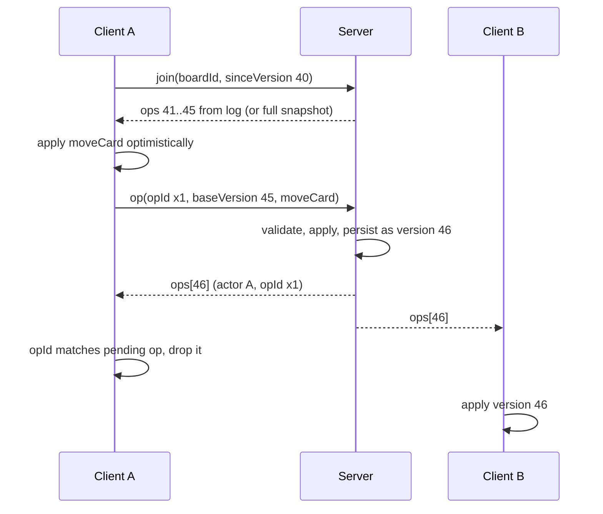

# syncboard

A realtime collaborative kanban board. Open a board URL in several browsers and edit together: card moves, edits, and column changes appear live for everyone, along with who is online and where their cursor is.

There are no accounts and no setup. Anyone with a board link can edit that board.

## Features

- Boards with columns and cards, created from a landing page and addressable at `/b/:boardId`
- Realtime sync over WebSocket with an authoritative server and versioned ops
- Optimistic updates on the client, with automatic rollback when the server rejects an op
- Live presence avatars and live cursors for everyone on the board
- Automatic reconnect with exponential backoff and incremental catch-up from an op log
- Smooth pointer-based drag and drop for cards (within and across columns) and for column reordering
- Card edit modal, inline column rename, column add and delete with confirmation
- SQLite persistence, so boards survive server restarts

## Quickstart

Requires Node 20 or newer.

### Development

```sh
npm install
npm run dev
```

This starts the API and WebSocket server on port 3090 and the Vite dev server on port 5173, which proxies `/api` and `/ws` to the backend. Open http://localhost:5173, create a board, and open the same board URL in a second window to see the sync.

### Production

```sh
npm install
npm run build
npm start
```

One process serves everything on http://localhost:3090: the built web app, the HTTP API, and the WebSocket endpoint. Configuration is via environment variables:

| Variable | Default | Purpose |
| --- | --- | --- |
| `PORT` | `3090` | HTTP and WebSocket port |
| `SYNCBOARD_DB` | `server/data/syncboard.db` | SQLite database path |
| `SYNCBOARD_WEB_DIST` | `web/dist` | Location of the built web app |

### Tests

```sh
npm test
```

Runs the server test suite (vitest): op application and validation, two-client convergence including a randomized interleaving fuzz, persistence roundtrips, and an end-to-end WebSocket integration test against the real server.

## Architecture

The repository is an npm workspace with three parts:

- `shared/` holds the protocol types and, importantly, `applyOp`, the single pure function that validates and applies every board mutation. Server and client import the same code, which is what makes optimistic previews match confirmed results.
- `server/` is Node with Express, `ws`, and `better-sqlite3`. It owns the truth: it validates each intent, applies it, persists it, and rebroadcasts it.
- `web/` is React 18 with Vite. No component library; the UI is hand-rolled CSS.

### Sync protocol

Every board has a version number that increases by exactly one per accepted op. Clients never mutate state directly; they send intents (`createCard`, `moveCard`, `editCard`, `deleteCard`, `duplicateCard`, `createColumn`, `renameColumn`, `deleteColumn`, `reorderColumn`) tagged with a client-generated `opId` and the version they were based on. The server applies intents in arrival order against its current state, so concurrent edits are serialized and every client converges on the same history.



Key mechanics:

- Optimistic apply and rollback. The client keeps the last confirmed server state plus a queue of pending ops. The rendered view is the confirmed state with pending ops replayed on top through the shared `applyOp`. When the server broadcasts an accepted op, the client advances its confirmed state; if the op was its own (matched by `opId`), the pending entry is dropped. When the server rejects an op (for example moving a card someone else just deleted), the client drops the pending entry and the view snaps back, with a small notice explaining why.
- Conflicts. Validation happens against current server state, so stale intents fail cleanly: a move of a deleted card is rejected with `card_not_found` rather than corrupting state. Index-based positions use remove-then-insert semantics and are clamped, so concurrent reorders of the same column stay valid and converge.
- Reconnect and replay. The connection retries with exponential backoff plus jitter. On rejoin, the client sends its last confirmed version. Each active board keeps an in-memory log of the last 500 applied ops; if the log covers the gap, the server replays only the missed ops, otherwise it sends a full snapshot. Pending ops are resent after a rejoin, minus any the catch-up already confirmed.
- Presence and cursors. Presence is broadcast on every join, leave, and rename. Cursor positions are sent at most about 15 times per second per client (and rate-limited again server side), relayed in board-content coordinates, and rendered by peers with a short transform transition for smooth motion.

### Data model

SQLite schema, written through on every accepted op inside a transaction:

```
boards   id TEXT PK, version INTEGER, created_at INTEGER
columns  id TEXT PK, board_id -> boards (CASCADE), title TEXT, ord INTEGER
cards    id TEXT PK, board_id -> boards (CASCADE),
         column_id -> columns (CASCADE), title TEXT, description TEXT, ord INTEGER
```

`ord` columns are kept normalized to 0..n-1 within their scope. Active boards live in server memory and are loaded on demand; rooms are evicted a few minutes after the last client leaves (the op log is dropped, persisted state is not).

### Project layout

```
shared/    protocol types, applyOp, id and color helpers
server/
  src/     store (SQLite), room (state + op log + clients), protocol parsing, HTTP/WS wiring
  test/    ops, convergence (including fuzz), persistence, WS integration
web/
  src/     board client (optimistic sync engine), connection (backoff),
           pointer drag and drop, pages and components, styles
```

## Limitations

- No authentication or authorization; a board id is the only secret, so treat links accordingly.
- Conflict resolution is last-writer-wins at op granularity. Two people editing the same card description at once do not merge text; the later save wins.
- The op log is in memory only. After a server restart, reconnecting clients receive a full snapshot instead of a replay.
- If a client resends pending ops after a full snapshot, an op the server had already applied can be applied twice. Most ops are idempotent or safely rejected, but a duplicate create is possible in that narrow window.
- Cursor positions are mapped in board-content coordinates, so they are approximate when viewers have very different layouts.
- Single-process server; rooms are held in local memory, so it does not scale horizontally without a shared broker.

## License

MIT, see [LICENSE](LICENSE).
